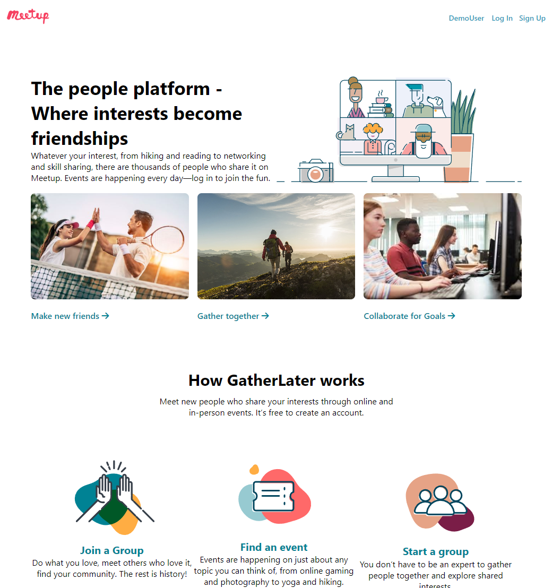
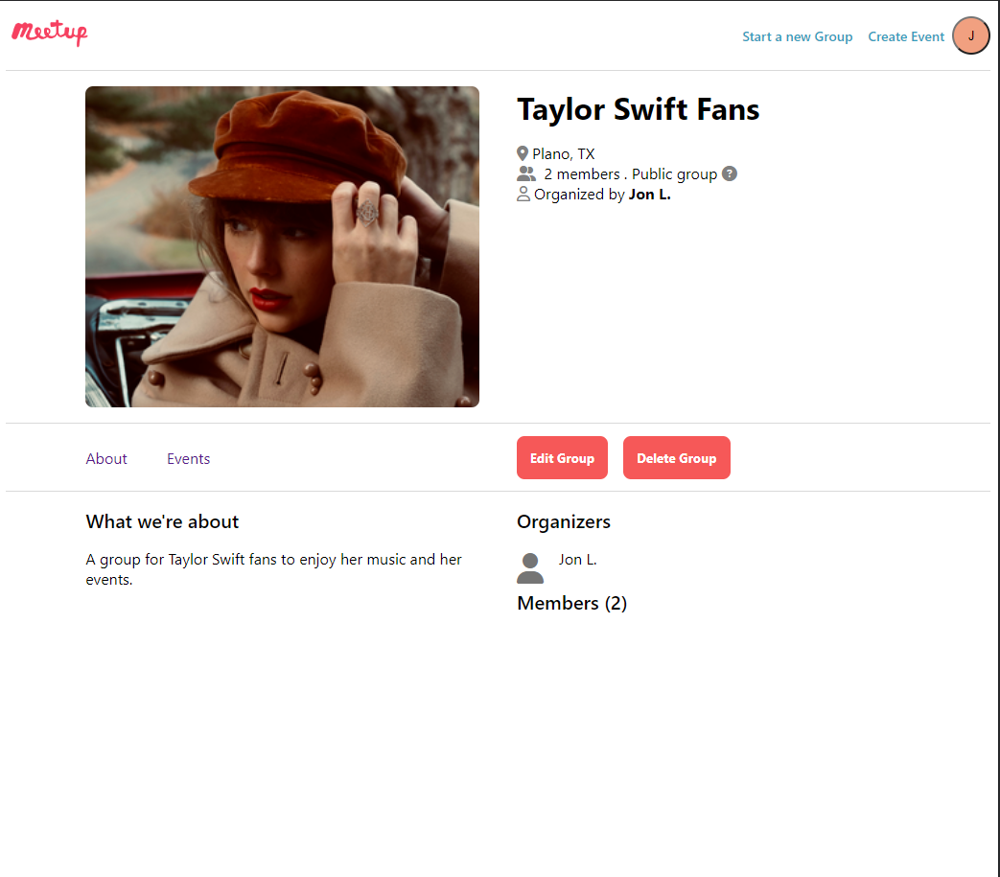
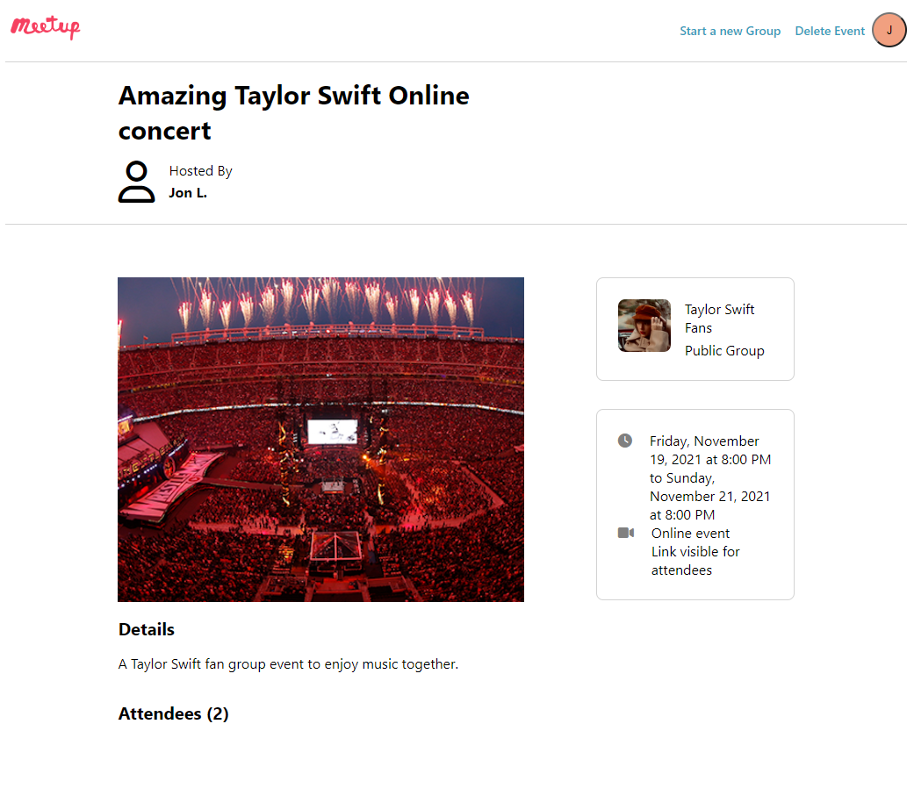

# GatherUp App

GatherUp is a website clone of the popular website Meetup. It can be used for setting up groups and events in those groups to coordinate events. 

Live site: <a href="https://meetupclone.onrender.com">GatherUp</a>

## Tech Stack

Frameworks, Platforms and Libraries

- JavaScripot
- HTML5
- Node.js
- CSS3
- Express.js
- React
- Redux

## Database:

- Postgress

## Hosting:

- Render

## Landing Page

You will be able to access the login page, signup page, and any of the links in the splash page will direct you to the group and events view page. You can also use the demo user button at the top right for you to check the website. 

</img>

## Events and Groups View

From here you can access all the events and groups and click on them to obtain more details. 

</img>

## Group Details View

From here you can access all the details on the specific group and access different information using the about and events tab. You can also delete or edit the group if you are the organizer. 

</img>

## Event Details View

From here you can access all the details on the specific event. You can also delete the event if you are the organizer of the group that owns the event.

</img>

## Future Features

- Attendance to events functionaltiy
- Membership functionaltiy
- Co-host member status

## Getting Started to run Locally

- Clone down the repository. 
- cd into backend folder and run the npm install command
- Run the commands "npx dotenv sequelize db:migrate" and "npx dotenv sequelize db:seed:all" to seed your initial data
- Run the npm start command inside the backend folder
- cd into frontend folder and run the npm install command
- Run the npm start command inside the frontend folder
- Interact with the website as you see fit. 

## Contact Information

For questions please send an email to jonlin234@gmail.com
